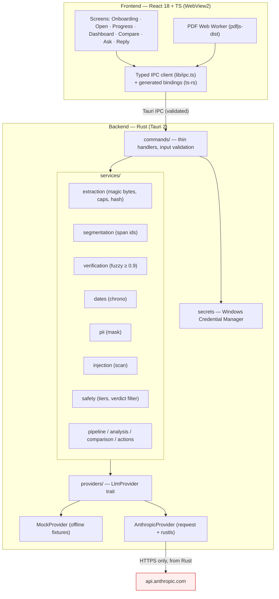

# Olai (ஓலை)

> **Olai explains documents. It is not a lawyer and does not give legal advice.**

Olai is a Windows desktop application that helps a non-lawyer make sense of a legal
notice and the agreement it relates to. You open the documents, and Olai helps you
**understand** them in plain language, **compare** the notice against your agreement to
surface conflicts, and **navigate** what to do next with a cited action checklist,
calendar reminders, and a neutral draft reply.

Built for the challenge: _“AI for Legal Assistance & Access: build a GenAI-powered
solution that makes legal information and basic assistance accessible by helping users
understand, compare, and navigate legal documents.”_

It works in **English**, **Tamil (தமிழ்)**, and **Hindi (हिन्दी)** with text‑to‑speech,
and ships a fully **offline demo mode** so it can be evaluated with no API key.

---

## How Olai addresses the challenge

### 🟦 Understand
- Identifies the **document type**, **parties**, **demands**, and **deadlines** in plain
  language (the “Paper Card”).
- Every statement Olai makes about a document is **grounded**: it cites a span id
  (`D{doc}-P{page}-S{n}`) and a verbatim quote of ≤ 25 words, which the Rust backend
  **verifies** against the stored text (normalized fuzzy similarity ≥ 0.9). Unverifiable
  statements are shown greyed out as **“Not confirmed”**, never as fact.
- Deadlines are computed **in code** (`chrono`), never by the model, and the UI shows the
  arithmetic (e.g. `2026-09-10 + 7 days = 2026-09-17`). If the anchor date is unknown,
  Olai **asks** instead of guessing.

### 🟨 Compare
- Puts the notice and your agreement in **two synchronized panes** with **linked
  highlights** and **numbered conflicts** (keyboard nav with `J`/`K`).
- Example from the demo: the notice demands you vacate in **7 days**, but **clause 9** of
  the agreement requires **one month’s** written notice — shown side by side with a
  neutral explanation and a severity that is always paired with an **icon + word** (never
  colour alone).

### 🟩 Navigate
- A **cited action checklist** grouped **Protect / Gather / Respond / Get help**, with
  **.ics** calendar export for deadlines.
- A **grounded Ask** panel that answers only from your documents (status pills:
  _Answered_, _Not in your documents_, _Needs a lawyer_).
- A **neutral draft reply** with footnotes, exportable to `.txt`.
- A **“Get help”** card pointing to free legal aid (sourced only from a bundled,
  verifiable knowledge pack).

---

## Responsible‑AI guarantees (enforced in code, not just prompts)

| Guarantee | Where it lives | Test |
| --- | --- | --- |
| Claims must cite & be verified (≥ 0.9, ≤ 25 words) | `services/verification.rs` | `verification::tests`, `fabricated_citation_is_marked_not_confirmed` |
| Dates/money computed in code, missing anchor asked | `services/dates.rs` | `dates::tests` (days, months, month‑end, DD/MM, missing anchor) |
| Documents are untrusted data; injection & hidden text flagged | `services/injection.rs` | `injection::tests`, `scam_demo_escalates_and_flags_injection` |
| Verdict words blocked (“genuine”, “valid”, “enforceable”, “you will win”) | `services/safety.rs` | `verdict_filter_blocks_banned_words` |
| Three help tiers; forced escalation for court/police, ≤ 7‑day deadlines, scams, strategy | `services/safety.rs` | `safety::tests`, `eviction_demo…escalates` |
| Q&A only from documents, else “Your documents don’t say this” | `services/pipeline.rs` | `eviction_qa_is_grounded_in_documents` |
| Legal aid only from a verifiable pack; `verifiedOn=null` hidden in release | `src/data/legal_aid.json`, `GetHelpCard.tsx` | `components.test.tsx` |
| Persistent “not a lawyer” disclaimer footer | `components/DisclaimerFooter.tsx` | `components.test.tsx` |

See **[RESPONSIBLE_AI.md](RESPONSIBLE_AI.md)** for the full policy.

---

## Architecture



**Layering rule:** `commands` (thin) → `services` (logic) → `providers` (trait with real +
mock). Everything is testable without the network via `MockProvider`.
Shared types are generated by `ts-rs` into `src/lib/bindings/` — no hand‑duplicated shapes.

---

## Screens

The demo (`Try the eviction notice demo`) exercises every screen. To regenerate the
images in `docs/screenshots/`, run the app in demo mode and capture:

1. **Onboarding** — language picker (EN/TA/HI), privacy explanation, optional API‑key
   entry, and **Try demo**.
2. **Dashboard** — help‑tier banner, Paper Card, deadline countdown with its calculation,
   and tabs (Overview / Conflicts / Actions / Ask / Missing Info).
3. **Compare** — two synchronized panes, linked highlights, numbered conflicts, `J`/`K`.
4. **Citation drawer** — the exact quote, page, and verification status.
5. **Actions** — Protect / Gather / Respond / Get help + **Add reminders (.ics)**.

---

## Setup

### Prerequisites
- **Node.js** ≥ 18.18 and npm
- **Rust** (stable, MSVC toolchain) via [rustup](https://rustup.rs)
- **Microsoft Visual Studio Build Tools** with “Desktop development with C++”
  (provides the MSVC linker)
- **WebView2 Runtime** (pre‑installed on Windows 11)

### Install & run
```bash
npm install                 # frontend deps
npm run tauri dev           # run the desktop app (compiles Rust + starts Vite)
```

### Demo mode (no API key required)
Launch the app and press **Try the eviction notice demo** (or the scam‑notice demo). Demo
mode uses bundled **synthetic** documents (fictional names) and a `MockProvider` that
replays recorded model responses — fully offline.

You can also run the demo journey headlessly in a browser (mocked IPC):
```bash
npm run test:e2e
```

---

## Commands

| Command | What it does |
| --- | --- |
| `npm run tauri dev` | Run the desktop app |
| `npm run tauri build` | Build the MSI/NSIS installer |
| `npm run dev` | Vite dev server (browser, mocked IPC) |
| `npm run build` | Type‑check + build the frontend |
| `npm test` / `npm run test:coverage` | Frontend unit/component/axe tests (+ coverage) |
| `npm run test:rust` | Rust unit + integration tests |
| `npm run coverage:rust` | Rust coverage (≥ 90% enforced) |
| `npm run test:e2e` | Playwright end‑to‑end (mocked IPC) |
| `npm run lint` / `npm run typecheck` / `npm run format:check` | Static checks |
| `npm run audit:all` | `npm audit` (prod) + `cargo audit` |
| **`npm run verify`** | **Lint + typecheck + format + all tests + coverage + audits + build** |
| `npm run bindings` | Regenerate `src/lib/bindings/` from Rust types |

---

## Privacy

Nothing is written to disk except app settings. **Documents live in memory only** and are
cleared on **“Delete everything”** or when the app closes. The Anthropic API key is stored
in the **Windows Credential Manager** (never in files, env, logs, or the frontend). All
network calls happen **only in Rust**, to `api.anthropic.com` over HTTPS.
See **[SECURITY.md](SECURITY.md)**.

---

## Limitations

- Olai gives **information and general guidance only** — not personalized legal advice, and
  never a verdict on whether a document is valid/enforceable.
- Analysis is **only as good as the extracted text**; low‑quality scans reduce OCR/citation
  quality (unverifiable claims are hidden, not guessed).
- The legal‑aid knowledge pack ships with **TODO placeholders**; cards with `verifiedOn =
  null` are **hidden in release builds** until the team verifies and dates each source.
- Windows‑only (Tauri + WebView2 + Credential Manager). Vision OCR requires an API key.

---

## Documentation index

- [RESPONSIBLE_AI.md](RESPONSIBLE_AI.md) — help tiers, grounding, known limitations
- [SECURITY.md](SECURITY.md) — STRIDE threat model, data flow, injection defenses, audits
- [ACCESSIBILITY.md](ACCESSIBILITY.md) — WCAG 2.2 AA conformance, axe + Narrator results
- [PERFORMANCE.md](PERFORMANCE.md) — size, memory, cold‑start measurements
- [TESTING.md](TESTING.md) — test strategy and coverage summary
- [docs/DECISIONS.md](docs/DECISIONS.md) — architectural decision log

## License

MIT.
